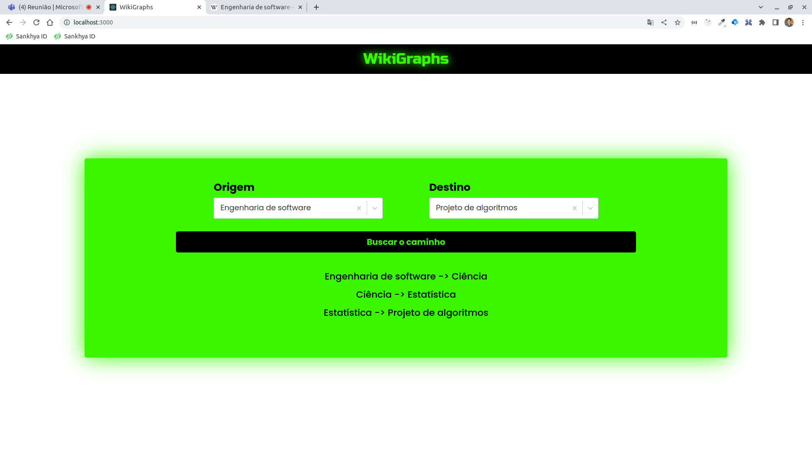

# WikiGraphs

**Número da Lista**: 15<br>
**Conteúdo da Disciplina**: Grafos 1<br>

## Alunos

|Matrícula | Aluno |
| -- | -- |
| 18/0033034  |  Hérick Ferreira de Souza Portugues |
| 18/0114093  |  Lucas Ursulino Boaventura |

## Sobre

O WikiGraphs é uma aplicação web que possui como objetivo apresentar o menor caminho entre duas páginas da Wikipédia. Para atingir esse objetivo foi construído um [Web Crawler](#4-extra-crawler) que inicia a extração pela página inicial da [Wikipédia](https://pt.wikipedia.org/wiki/Wikip%C3%A9dia) e vai percorrendo os links encontrados, encarando as páginas como **nós** e os links entre elas como **arestas** para abstrair a ideia de grafos. Para encontrar o menor caminho entre as páginas foi aplicado o algoritmo de busca em largura (BFS) nos dados coletados pelo crawler.

## Link da apresentação

**Adicione a apresentação do projeto.**
[Apresentação](./assets/apresentacao-LucasHerick.mp4)

## Screenshots

**Adicione 3 ou mais screenshots do projeto em funcionamento.**



## Instalação

**Linguagem**: JavaScript - Node v16.13.1<br>
**Framework**: ReactJS<br>

## Uso

### 1. Clone o projeto

```bash
git clone https://github.com/projeto-de-algoritmos/Grafos1_WikiGraphs.git
```

### 2. Instale as dependências do projeto

```bash
yarn
```

ou

```bash
npm install
```

### 3. Rode o projeto

```bash
yarn start
```

ou

```bash
npm start
```

### 4. Extra: Crawler

Atualmente, o projeto está rodando com uma base de dados com cerca de 134 mil páginas mapeadas, mas apenas 10 mil destas foram percorridas pelo crawler para "extrair" os links. Para utilizá-las, basta alterar o import em ```src/App.js``` e ```src/data/graph.js``` substituindo pelo arquivo desejado **(Obs: Essas mudanças podem acarretar em problemas de performance, devido ao tamanho dos arquivos)**. Além disso, caso queira rodar o crawler para uma quantidade diferente de páginas basta utilizar o comando abaixo (substituindo QTD_PAGE pela quantidade desejada):

```bash
yarn crawler <QTD_PAGE>
```

O resultado estará no caminho src/dump/graph_titles.json.
